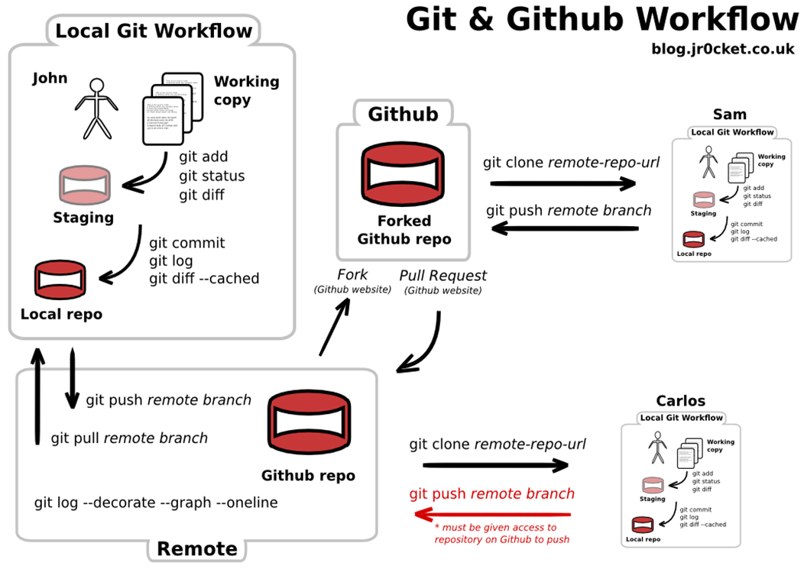

<!-- -*- coding: utf-8 -*- -->

# Python: что это, откуда и зачем
# И немножко GitHub

### Луцив Дмитрий Вадимович1,2
### Кознов Дмитрий Владимирович2

1СПбАУ &nbsp;&nbsp; 2СПбГУ

Введение в программирование на Python

<!--.slide: style="text-align:center;" -->
<!-- [PDF](?print-pdf) -->

= = = = = = = = = = = = =

# Почему Python?

- - - - - - - - - - - - -
## Популярность Python I

Насколько Python популярен по версии Google

По запросу [«Python»](https://trends.google.ru/trends/explore?date=all&q=Python)

* Тенденция к росту интереса с 2009 г.
* В основном, запросы по фреймворкам (не научным)

По запросу [«Numpy»](https://trends.google.ru/trends/explore?date=all&q=Numpy)

* Монотонный рост
* В основном — более «научные» запросы

В сравнении с [Java и С++](https://trends.google.ru/trends/explore?date=all&q=Python,Java,C%2B%2B)

* С++ держит примерно постоянный уровень (это не стагнация на самом деле характер интереса меняется)
* Python догоняет Java, Java падает навстречу Python

- - - - - - - - - - - - -
## Популярность Python II

Самые популярные языки программирования в 2017 г. по версии GitHub и Tiobe

<!--.element: style="height:600px;" -->
<!--.slide: style="text-align:center;" -->

* По версии GitHub https://octoverse.github.com/
* Значительный прогресс с 2016 г. https://octoverse.github.com/2016/
* Невыраженная положительная динамика с 2002 г. https://www.tiobe.com/tiobe-index/

А что это за GitHub?.. А об этом позже.<!-- .element: class="fragment" -->

= = = = = = = = = = = = =
# Происхождение и история Python

- - - - - - - - - - - - -
## Где и для чего появился Python?

Для чего изначально создавался Python?

* Администрирование системы Amoeba, разрабатываемой под руководством Э.&nbsp;Танненбаума в Free University Amsterdam
  https://docs.python.org/3/faq/general.html#why-was-python-created-in-the-first-place

На какие существующие языки он был похож?

* Python создавался под влиянием языков Modula 3, C и <a href="https://en.wikipedia.org/wiki/ABC_(programming_language)#Example">ABC</a>
https://www.levenez.com/lang/lang.pdf

- - - - - - - - - - - - -
## Развитие Python

* G. van Rossum начал работу в 1989 г.
* В 1991 г. анонсирована версия 0.9.0, в 1994 – 1.0
* В 2002 г. запущен репозиторий библиотек для Python – Python Package Index
* Поступательное развитие до 2009 года, с 2009 – разделение на ветки 2.Х (сопровождение) и 3.X

= = = = = = = = = = = = =
# Актуальные свойства Python

- - - - - - - - - - - - -
## Свойства языка (строго)

* Интерпретируемый (с оговорками)
* Возможность интеграции с библиотеками на C/C++ для повышения производительности
* Сильно типизированный
* Динамически типизированный
* Мультипарадигменный
    * Императивный
    * Процедурный, объектно-ориентирвоанный
    * Чуть-чуть функциональный
* Не структурный
    * и, конечно же, не expresion oriented — см. принцип [command-query separation](https://en.wikipedia.org/wiki/Command\%E2\%80\%93query_separation)

- - - - - - - - - - - - -
## Свойства языка (нестрого)

* Небыстрый (с оговорками)
* Универсальный (не DSL)
* Удобен для обработки строк и списков
* Простой в освоении
* Очень легко читается — почти псевдокод
* Достаточно лаконичный
* Общность приносится в жертву удобству в типичных частных случаях
* Очень богатая экосистема модулей
    * вычислительные библиотеки — научные и инженерные
    * системные — реализация и сопряжение с серверами, СУБД и т.д.

- - - - - - - - - - - - -
## Свойства языка (совсем нестрого)

Python — язык, позволяющий эффективно и комфортно решать задачу, минимально отвлекаясь на программирование как таковое

- - - - - - - - - - - - -
## Zen of Python

    >>> import this
    
    The Zen of Python, by Tim Peters
    
    Beautiful is better than ugly.
    Explicit is better than implicit.
    Simple is better than complex.
    Complex is better than complicated.
    Flat is better than nested.
    Sparse is better than dense.
    Readability counts.
    Special cases aren't special enough to break the rules.
    Although practicality beats purity.
    Errors should never pass silently.
    Unless explicitly silenced.
    In the face of ambiguity, refuse the temptation to guess.
    There should be one-- and preferably only one --obvious way to do it.
    Although that way may not be obvious at first unless you're Dutch.
    Now is better than never.
    Although never is often better than *right* now.
    If the implementation is hard to explain, it's a bad idea.
    If the implementation is easy to explain, it may be a good idea.
    Namespaces are one honking great idea -- let's do more of those!

= = = = = = = = = = = = =
# Кто использует Python?

- - - - - - - - - - - - -
## Программные проекты

* Blender – популярный 3D-редактор
* BitTorrent, Deluge – файлообменные программы
* Mercurial – система управления версиями
* Dropbox – облачное хранилище
* Компьютерные игры и фреймворки для них – World of Tanks, Civilization IV, The Sims, RenPy
* Plone, Zope – системы управления контентом
* NLTK – анализаторы текстов на естественных языках
* NumPy, SciPy, Pandas – библиотеки для научных вычислений и анализа данных
* Внутренние проекты Google и Yahoo
* ...

- - - - - - - - - - - - -
## Исследователи

* Метеорологи
* Экологи
* Боинформатики
* Специалисты по вычислительной и теоретической физике
* NASA
* ...

- - - - - - - - - - - - -
## И так далее...

https://wiki.python.org/moin/OrganizationsUsingPython

= = = = = = = = = = = = =
# A теперь немного о Git и GitHub

- - - - - - - - - - - - -
## Configuration & change management

Организация работы с активами проекта (кодом, документацией, тестами, требованиями, дизайн-спецификациями и пр.)

* Организация корректного внесения изменений
* Доступ, хранение, история изменений, поддержка распределённого доступа 
* Контроль целостности

\* Д.В. Кознов. Введение в программную инженерию <!-- .element: style="color: red; text-align: right;" -->

- - - - - - - - - - - - -
## Типичные проблемы отсутствия конфигурационного управления

* Не может быть найдена последняя версия кода
* Трудная  ошибка, которая была исправлена, неожиданно появилась
* Разработанная и оттестированная функциональность (feature) таинственным образом исчезла
* Полностью оттестированная программа не работает
* Тестируется неактуальная версия

\* Д.В. Кознов. Введение в программную инженерию <!-- .element: style="color: red; text-align: right;" -->

- - - - - - - - - - - - -
## Git

* Конфигурационное управление в программных проектах
* Управление версиями: централизованное и распределённое

- - - - - - - - - - - - -
## Git Workflow

 <!-- .element: style="width: 1200px;" -->

<!--.element: style="text-align:center;" -->

Источник: http://slidedeck.io/themouette/slides-git

- - - - - - - - - - - - -
## GitHub

* Хранилище исходных кодов программных проектов
* Исходные коды как открытых (open source), так и коммерческих проектов
* Здесь держат исходные коды такие компании как  IBM, Microsoft, HP, JetBrains
* Владелец ресурса – компания Microsoft (2018 г.)
* https://github.com/

---

* Программные проекты с открытым исходным кодом
* Хостинг открытых программных проектов
    * Один из «старых» известных – SourceForge
* Идея «Social Coding»
    * GitHub, GitLab, BitBucket

- - - - - - - - - - - - -
## GitHub Workflow

 <!-- .element: style="width: 1200px;" -->

<!--.element: style="text-align:center;" -->

- - - - - - - - - - - - -
## GitHub для нас

* Хранение и публикация выполненных заданий
* Проверка и обсуждение решений

= = = = = = = = = = = = =
# Спасибо!

 <!-- .element: style="width: 600px;" -->
<!--.slide: style="text-align:center;" -->
